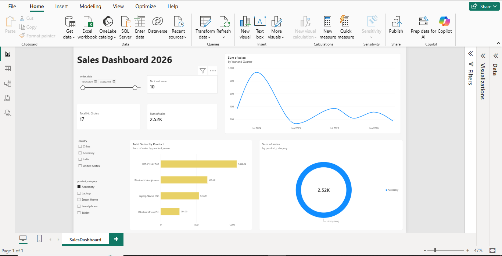

#  Sales Dashboard 2026 - Power BI

##  Project Overview

This is my first Power BI dashboard, created as part of my learning journey in Data Analytics and Business Intelligence.

The dashboard provides an interactive view of sales performance, customers, orders, products, and product categories.

##  Objective

The objective of this project was to learn how to:

- Import and work with data in Power BI
- Create interactive dashboards
- Build different types of visualizations
- Use filters and slicers
- Analyze sales trends
- Create basic KPIs
- Explore data using Power BI

##  Tools & Technologies

- Power BI
- Power Query
- DAX
- Excel

##  Dashboard Features

The dashboard includes:

- Total Sales
- Number of Customers
- Number of Orders
- Sales trend over time
- Sales by Product
- Sales by Product Category
- Country-based filtering
- Product Category filtering
- Date filtering

##  Dashboard Preview

##  Key Metrics

The dashboard currently displays:

- **Total Sales:** 2.52K
- **Number of Customers:** 10
- **Number of Orders:** 17

##  What I Learned

Through this project, I gained hands-on experience with:

- Connecting data to Power BI
- Creating charts and visualizations
- Creating KPI cards
- Adding slicers and filters
- Working with dates
- Analyzing product-level sales
- Creating an interactive report

##  Future Improvements

I plan to improve this dashboard by adding:

- More detailed DAX measures
- Profit and profit margin analysis
- Year-over-year growth
- More advanced data modeling
- Additional dashboard pages
- More detailed business insights

##  Project Files

- `My First Dashboard.pbix` - Power BI dashboard file
- `dashboard.png` - Dashboard preview

---

###  About

This project represents one of my first hands-on projects while learning Data Analytics, Power BI, and Business Intelligence.